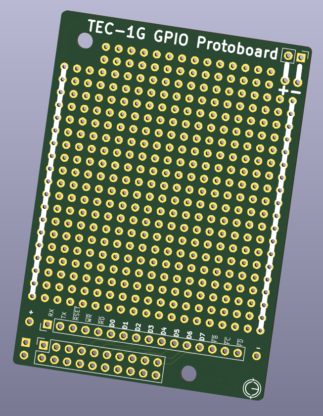

# TEC-1G GPIO Protoboard

Have an idea for the TEC-1G and want to quickly prototype it over the weekend?
Then you need one of these!

[Download the Gerbers](./TEC-1G_GPIO_Protoboard_Gerbers_v1-3.zip) and get yourself a set so you're always ready for your creativity to flow.

Once you have designed your circuit and tested it out, why not make a PCB and share it with the TECian community!

[Download the KiCAD 8 design files](./TEC-1G_GPIO_Protoboard_v1-3_KiCADv8.zip) of this board, and then removed the parts you don't need,
like all the through hole dots. Make sure you don't move the EdgeCuts, the Mounting Holes and of course the two headers
to ensure they line up with the TEC-1G motherboard.

If you wish to purchase a TEC-1G Proto-Pack which has this and any other Protoboards developed for the TEC-1G,
please check the listing on Tindie, Coming Soon (tm).
