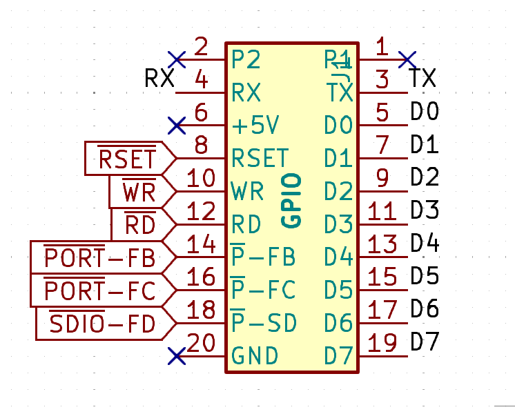

# TEC-1G GPIO Connector

## Expansion Modules available for the GPIO Connector
| Module | Description | Version |
|---|---|---|
| [GPIO Protoboard](./Protoboard/) | The protoboard gerbers & design files - Use as a Template!  | 1.3 |
| [GPIO SD Card](./SD-Card/) | Micro SD-Card interface, as well as a general purpose 8Bit input/output board | 1.3 |
| [GPIO RTC](./RTC/) | Real Time Clock and Parameter RAM  | 1.3 |
| [GPIO Printer](./Printer/) | Parallel Printer Interface, and a general purpose 8Bit input/output board  | 1.3 |
| [GPIO New Board!](./) | Add your guesses to the "New GPIO Board" Issue for a chance to win a free kit!  | 1.3 |

#### Adding General Purpose Input/Output capabilities to the TEC-1G, easily.

Version 1.3 of the GPIO connector adds 4 pins to the original 16!

2 pins are spare and can be used by the user for anything they want to propagate up the GPIO stack.

We have also added the Transmit and Receive lines as used by the FTDI module.

These have been added for a NEW board, Coming Soon (tm)!

