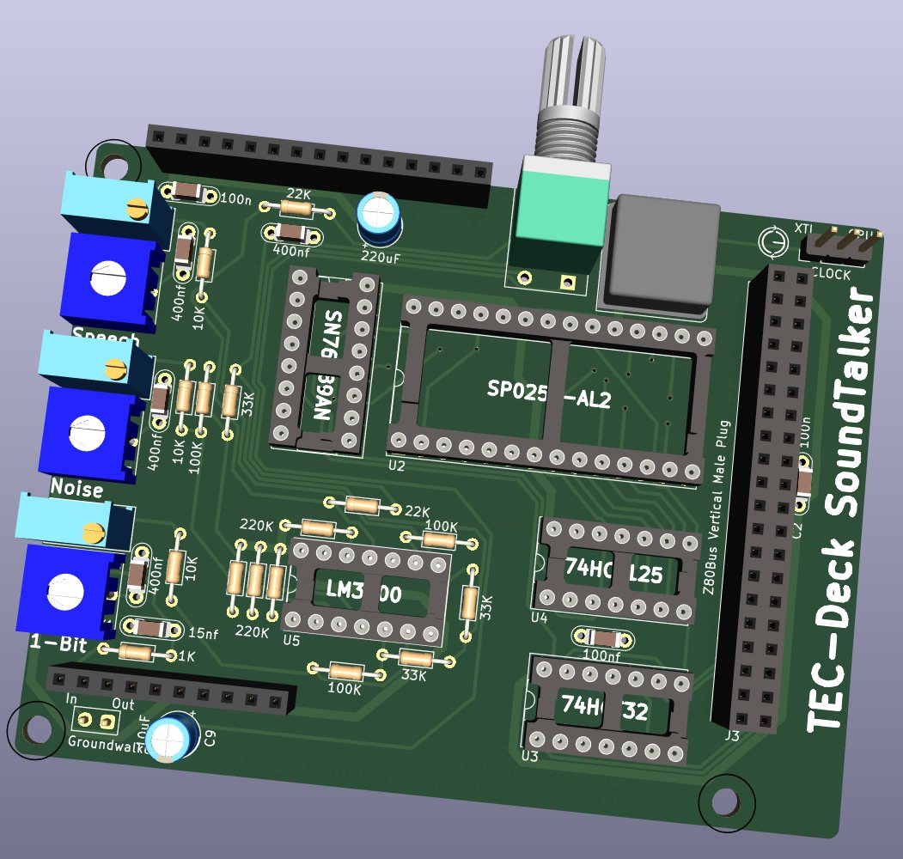

# SoundTalker Audio Card

- SN76489 Sound Geberator
- SP0256A-AL2 Speech Processor
- Mix in standard TEC-1 1-Bit sounds
- Using LM3900 Op Amp

This is Beta 2, using a LM3900 for pre-amp/mixer and amplifier:

